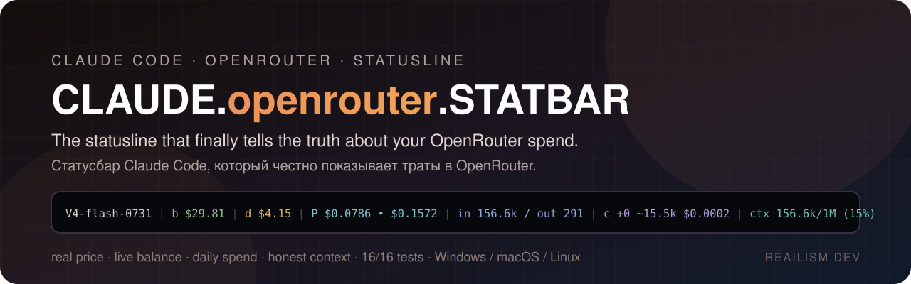
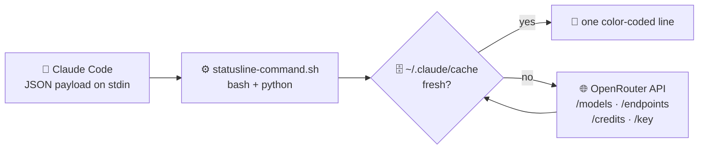
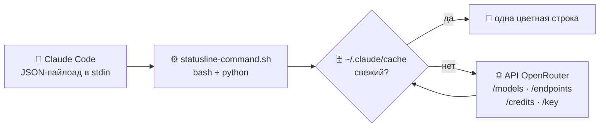

<div align="center">

> 🇷🇺 **Русская версия доступна ниже** — [перейти к русской документации ↓](#ru)



# ⚡ CLAUDE.openrouter.STATBAR

**The statusline that finally tells the truth about your OpenRouter spend.**


[**Install**](#️-install-in-3-steps) · [**What it looks like**](#-what-it-looks-like) · [**How it works**](#-how-it-works) · [**Tests**](#-tests) · [**Security**](#-security) · [**Русский**](#ru)

</div>

---

Running Claude Code through OpenRouter? The built-in status bar lies to you — it
uses Anthropic's private price table, invents a fake ~200k context window for
models that really have 1M, and shows `$0` for models it doesn't recognize.

**CLAUDE-STATBAR** plugs straight into the OpenRouter API and shows you the **real**
numbers — today's actual price with the provider's discount, your live key
balance, daily spend, real context limit, and a full token/cache breakdown.
One glance at the bottom of your terminal and you know exactly what you're
spending, in real dollars.

## 🔥 Why you'll love it

| ❌ The built-in statusline does this | ✅ CLAUDE-STATBAR does this |
|---|---|
| Shows `$0` / garbage for non-Anthropic models | Shows the **real price per 1M tokens**, including the provider's live discount |
| Invents a ~200k context window | Shows the **true model limit** (e.g. 1,048,576 for DeepSeek V4 Flash) with an honest usage % |
| No balance, no spend | Live **key balance** + **daily spend** |
| One dull line | A **color-coded, scannable** statusline that works in any terminal |

## ⚡ What it looks like

```
V4-flash-0731 | b $29.81 | d $4.15 | P $0.0786 • $0.1572 | in 156.6k / out 291 | c +0 ~15.5k $0.0002 | ctx 156.6k/1M (15%)
```

| Segment | Meaning |
|---|---|
| `V4-flash-0731` | model (version slug) |
| `b $29.81` | 🟢 OpenRouter **key balance** — muted green |
| `d $4.15` | 🟡 **daily spend** — muted amber |
| `P $0.0786 • $0.1572` | 🔵 model price per 1M tokens — **input • output**, discounted — muted cyan |
| `in 156.6k / out 291` | 🔷 session **tokens** in/out — muted blue |
| `c +0 ~15.5k $0.0002` | 🟣 cache write (`+`) / cache read (`~`) + its real cost — muted purple |
| `ctx 156.6k/1M (15%)` | 🟩 context used vs the **real** limit + honest % — teal |

Every segment appears **only when the data is real** — it never shows a fake `0`.

## ✨ Features

- 🔵 **True pricing** — pulls today's effective per-1M price (list price minus the
  provider's promo) straight from the OpenRouter endpoints API.
- 💰 **Live balance & spend** — your key balance and daily usage at a glance.
- 🧠 **Real context** — shows the model's actual available context, not Claude Code's
  bogus fallback, with a **correct** usage percentage.
- 🧾 **Token & cache audit** — input/output tokens plus cache read/write *and* what
  the cache reads actually cost you.
- 🎨 **Subtle colors** — a quiet, muted palette so the line is readable, not loud.
- ⚡ **No API spam** — everything is cached (prices 6h, balance/spend 5min), so it
  never hammers OpenRouter on redraws.
- 🧪 **Fully tested** — an offline, deterministic test suite (16 checks).

## 🛠️ Install in 3 steps

> Takes about 60 seconds. No build, no dependencies beyond `bash`, `python3`, `curl`.

**0 — Get the files**

```bash
git clone https://github.com/dobrdigital/CLAUDE.openrouter.STATBAR
cd CLAUDE.openrouter.STATBAR
```

**1 — Copy the script**

```bash
cp statusline-command.sh ~/.claude/statusline-command.sh
```

**2 — Point it at your key**

Open `~/.claude/settings.json` and set your OpenRouter key as an environment
variable (or `export` it in your shell):

```json
{
  "env": {
    "ANTHROPIC_BASE_URL": "https://openrouter.ai/api",
    "ANTHROPIC_AUTH_TOKEN": "sk-or-v1-YOUR_KEY"
  }
}
```

**3 — Wire up the statusline**

```json
{
  "statusLine": {
    "type": "command",
    "command": "bash ~/.claude/statusline-command.sh"
  }
}
```

A ready-made template is in [`settings.example.json`](settings.example.json).
Restart Claude Code, send any message, and watch your terminal come alive. 🎉

## ▶️ Try it on any machine (no Claude Code needed)

Pipe a sample payload straight through the script:

```bash
cat example-payload.json | ANTHROPIC_AUTH_TOKEN="sk-or-v1-YOUR_KEY" bash statusline-command.sh
```

## 🔍 How it works



- **List prices + real context** → `GET /api/v1/models` (cached 6h).
- **Effective price** (your actual cost) → `GET /api/v1/models/{id}/endpoints`
  — the same discounted number the OpenRouter website shows.
- **Balance** → `GET /api/v1/credits` (cached 5min).
- **Daily spend** → `GET /api/v1/key` (cached 5min).
- Cached under `~/.claude/cache/` so the API is never hit on every redraw.

## 🧪 Tests

`test-statusline.sh` runs the script against synthetic payloads and asserts every
segment — including the tricky ones (the honest context %, the discounted price,
the `M`/`k` formatting). It seeds a throwaway HOME, so it's **offline and
deterministic**:

```bash
bash test-statusline.sh
# === 16 passed, 0 failed ===
```

## 🔒 Security

- 🙈 **No keys in the repo** — only placeholders. Real keys live in your local
  `settings.json`, which `.gitignore` keeps out of version control.
- 🛡️ A **post-write guard** and a **git pre-commit hook** ([`hooks/pre-commit`](hooks/pre-commit)) scan every file you write
  for a real `sk-or-v1-` / `sk-ant-` key and block it before it can be committed.
- 🔑 If a key is ever exposed anywhere — rotate it at
  [OpenRouter → Keys](https://openrouter.ai/settings/keys).

## 📦 Dependencies

`bash`, `python3`, `curl` — every OS ships them or installs in seconds.

## 📄 License

[MIT](LICENSE). Free to use, fork, and build on.

---

<div align="center">

*Built with ❤ at **REAILISM.DEV** — because your spend deserves the truth.*

</div>

---

<a name="ru"></a>

<details>
<summary><b>🇷🇺 Русская документация — нажмите, чтобы развернуть</b></summary>

<br>

<div align="center">

# ⚡ CLAUDE.openrouter.STATBAR

**Статус-строка, которая наконец честно показывает, сколько вы тратите в OpenRouter.**

[**Установка**](#️-установка-в-3-шага) · [**Как выглядит**](#-как-это-выглядит) · [**Как устроено**](#-как-это-работает) · [**Тесты**](#-тесты) · [**Безопасность**](#-безопасность)

</div>

---

Запускаете Claude Code через OpenRouter? Встроенная статус-строка вам врёт — она
берёт закрытый прайс Anthropic, придумывает фальшивое окно контекста ~200k для
моделей, у которых на самом деле 1M, и показывает `$0` для незнакомых ей моделей.

**CLAUDE-STATBAR** подключается напрямую к API OpenRouter и показывает **настоящие**
цифры — сегодняшнюю цену со скидкой провайдера, живой баланс ключа, расход за день,
реальный лимит контекста и полную раскладку токенов и кэша. Один взгляд вниз
терминала — и вы точно знаете, сколько тратите, в реальных долларах.

## 🔥 Почему это удобно

| ❌ Встроенная статус-строка | ✅ CLAUDE-STATBAR |
|---|---|
| Показывает `$0` / мусор для моделей не от Anthropic | Показывает **реальную цену за 1M токенов** с живой скидкой провайдера |
| Придумывает окно контекста ~200k | Показывает **настоящий лимит модели** (например, 1 048 576 у DeepSeek V4 Flash) и честный % |
| Ни баланса, ни расходов | Живой **баланс ключа** + **расход за день** |
| Одна скучная строка | **Цветная, легко читаемая** строка, работает в любом терминале |

## ⚡ Как это выглядит

```
V4-flash-0731 | b $29.81 | d $4.15 | P $0.0786 • $0.1572 | in 156.6k / out 291 | c +0 ~15.5k $0.0002 | ctx 156.6k/1M (15%)
```

| Сегмент | Значение |
|---|---|
| `V4-flash-0731` | модель (версия) |
| `b $29.81` | 🟢 **баланс ключа** OpenRouter — приглушённый зелёный |
| `d $4.15` | 🟡 **расход за день** — приглушённый янтарный |
| `P $0.0786 • $0.1572` | 🔵 цена модели за 1M токенов — **вход • выход**, со скидкой — приглушённый голубой |
| `in 156.6k / out 291` | 🔷 **токены** сессии вход/выход — приглушённый синий |
| `c +0 ~15.5k $0.0002` | 🟣 запись в кэш (`+`) / чтение из кэша (`~`) + реальная стоимость — приглушённый фиолетовый |
| `ctx 156.6k/1M (15%)` | 🟩 занятый контекст от **реального** лимита + честный % — бирюзовый |

Каждый сегмент появляется **только когда данные настоящие** — фальшивого `0` не будет.

## ✨ Возможности

- 🔵 **Настоящие цены** — сегодняшняя фактическая цена за 1M (прайс минус акция
  провайдера) прямо из API эндпоинтов OpenRouter.
- 💰 **Живой баланс и расход** — баланс ключа и траты за день одним взглядом.
- 🧠 **Реальный контекст** — настоящий доступный контекст модели, а не ложный
  запасной лимит Claude Code, с **правильным** процентом.
- 🧾 **Аудит токенов и кэша** — токены вход/выход, чтение/запись кэша *и* сколько
  на самом деле стоили чтения из кэша.
- 🎨 **Спокойные цвета** — приглушённая палитра: строка читается, а не кричит.
- ⚡ **Без спама в API** — всё кэшируется (цены 6 ч, баланс/расход 5 мин), поэтому
  перерисовки не долбят OpenRouter.
- 🧪 **Покрыто тестами** — офлайн, детерминированный набор (16 проверок).

## 🛠️ Установка в 3 шага

> Около минуты. Ничего собирать не нужно, из зависимостей только `bash`, `python3`, `curl`.

**0 — Скачайте файлы**

```bash
git clone https://github.com/dobrdigital/CLAUDE.openrouter.STATBAR
cd CLAUDE.openrouter.STATBAR
```

**1 — Скопируйте скрипт**

```bash
cp statusline-command.sh ~/.claude/statusline-command.sh
```

**2 — Укажите свой ключ**

Откройте `~/.claude/settings.json` и задайте ключ OpenRouter как переменную
окружения (или сделайте `export` в своей оболочке):

```json
{
  "env": {
    "ANTHROPIC_BASE_URL": "https://openrouter.ai/api",
    "ANTHROPIC_AUTH_TOKEN": "sk-or-v1-ТВОЙ_КЛЮЧ"
  }
}
```

**3 — Подключите статус-строку**

```json
{
  "statusLine": {
    "type": "command",
    "command": "bash ~/.claude/statusline-command.sh"
  }
}
```

Готовый шаблон — в [`settings.example.json`](settings.example.json).
Перезапустите Claude Code, отправьте любое сообщение — и терминал оживёт. 🎉

## ▶️ Попробовать на любой машине (без Claude Code)

Прогоните пример пайлоада прямо через скрипт:

```bash
cat example-payload.json | ANTHROPIC_AUTH_TOKEN="sk-or-v1-ТВОЙ_КЛЮЧ" bash statusline-command.sh
```

## 🔍 Как это работает



- **Прайс + реальный контекст** → `GET /api/v1/models` (кэш 6 ч).
- **Фактическая цена** (то, что вы реально платите) → `GET /api/v1/models/{id}/endpoints`
  — та же цена со скидкой, что показывает сайт OpenRouter.
- **Баланс** → `GET /api/v1/credits` (кэш 5 мин).
- **Расход за день** → `GET /api/v1/key` (кэш 5 мин).
- Кэш лежит в `~/.claude/cache/`, поэтому API не дёргается при каждой перерисовке.

## 🧪 Тесты

`test-statusline.sh` прогоняет скрипт на синтетических пайлоадах и проверяет каждый
сегмент — включая хитрые (честный % контекста, цена со скидкой, форматирование
`M`/`k`). Он создаёт временный HOME, поэтому работает **офлайн и детерминированно**:

```bash
bash test-statusline.sh
# === 16 passed, 0 failed ===
```

## 🔒 Безопасность

- 🙈 **Никаких ключей в репозитории** — только плейсхолдеры. Настоящие ключи живут в вашем
  локальном `settings.json`, который `.gitignore` не пускает в git.
- 🛡️ **Guard после записи** и **git pre-commit хук** ([`hooks/pre-commit`](hooks/pre-commit)) проверяют каждый
  файл на настоящий ключ `sk-or-v1-` / `sk-ant-` и блокируют его до коммита.
- 🔑 Если ключ где-то засветился — перевыпустите его в
  [OpenRouter → Keys](https://openrouter.ai/settings/keys).

## 📦 Зависимости

`bash`, `python3`, `curl` — есть в любой ОС или ставятся за секунды.

## 📄 Лицензия

[MIT](LICENSE). Свободно используйте, форкайте и развивайте.

---

<div align="center">

*Сделано с ❤ в **REAILISM.DEV** — потому что ваши расходы заслуживают правды.*

</div>

</details>
